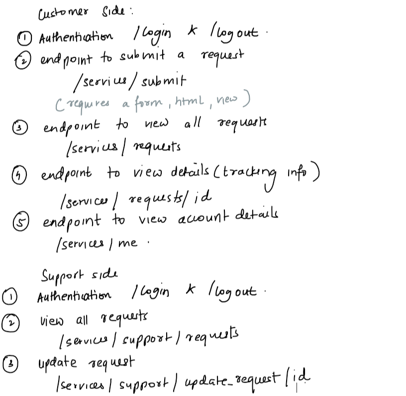
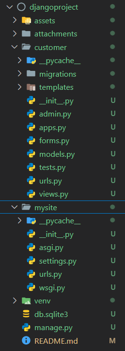
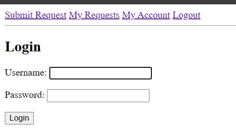
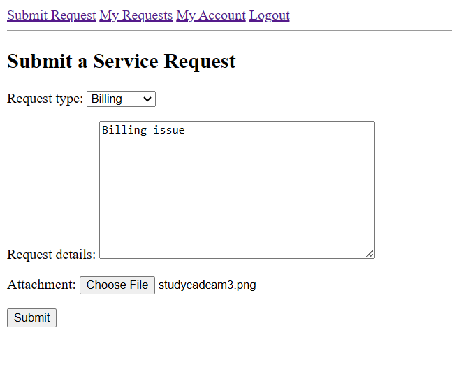
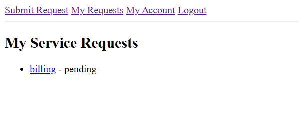
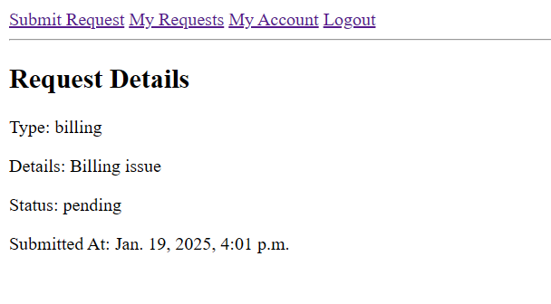
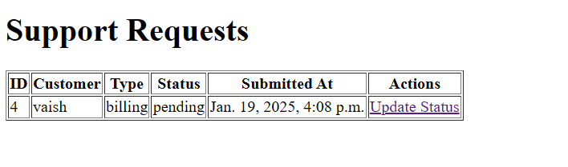
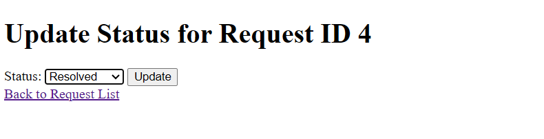
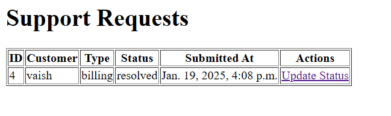
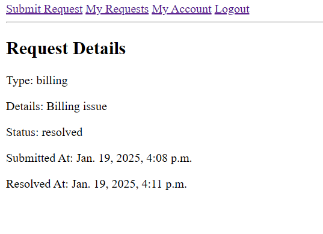

# django-assignment
## Solution:

## Structure

- mysite is the main project
- customer is the app created and added to settings.py
- customer is handling all the urls for customer and support side both
## Interface
## Admin

## Login

## Requests

## Account

## Support

